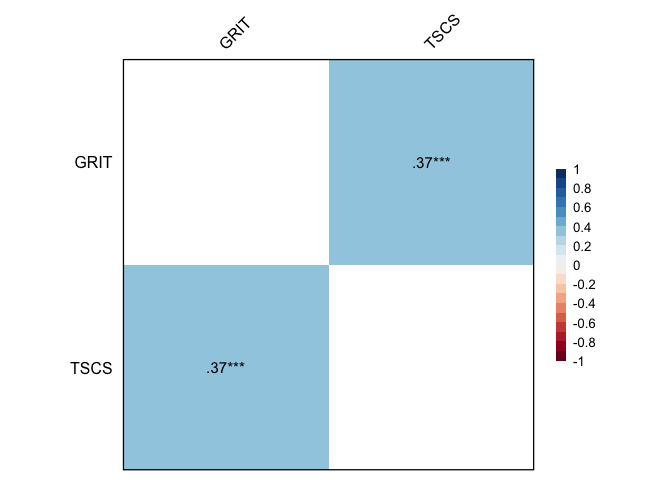
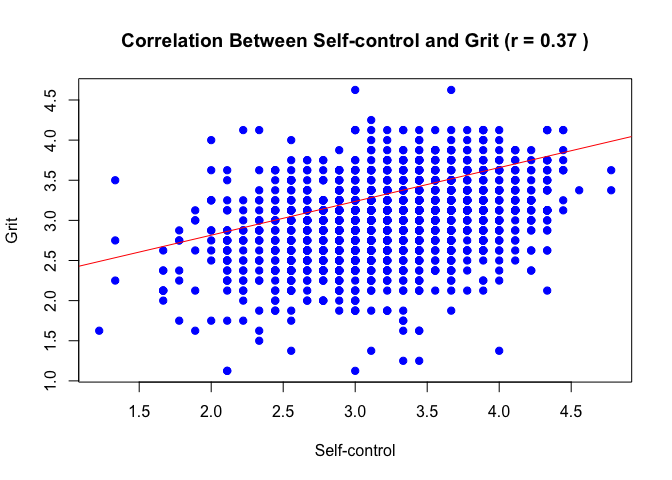
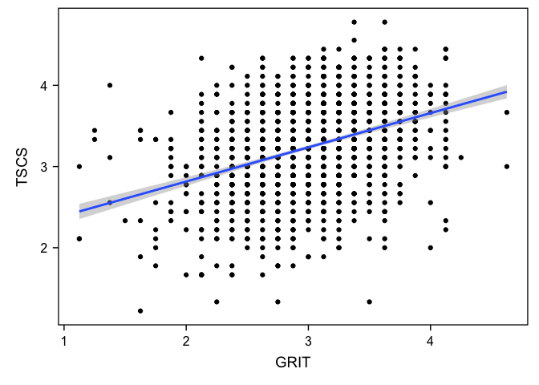
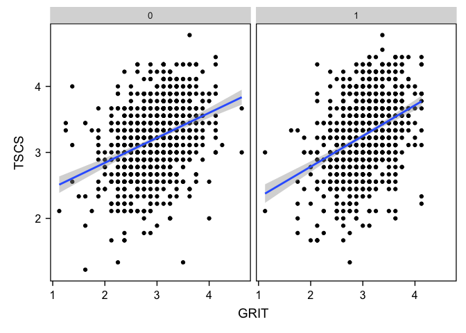
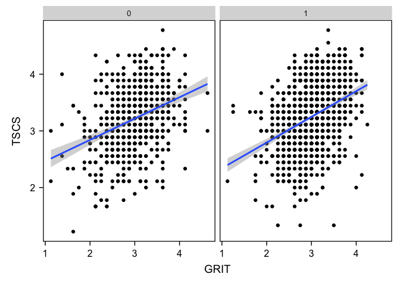
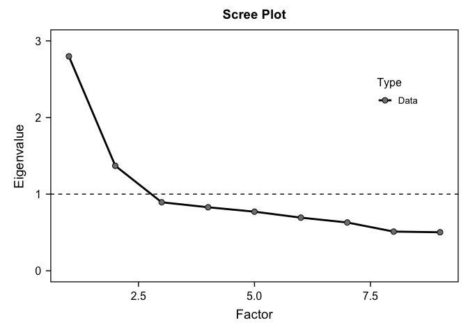
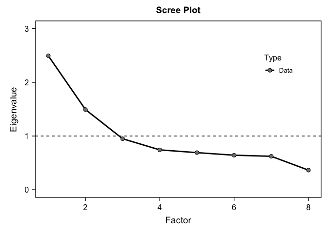

My project
================
Casey Zhang
2024-10-10

# Load packages and dataset

``` r
library(haven) #to load datasets (.csv, .hav)
library(dplyr) #to recode variables
```

    ## 
    ## Attaching package: 'dplyr'

    ## The following objects are masked from 'package:stats':
    ## 
    ##     filter, lag

    ## The following objects are masked from 'package:base':
    ## 
    ##     intersect, setdiff, setequal, union

``` r
library(ggplot2) #density plots, etc.
library(tidyr)

library(haven)
library(dplyr)
library(tidyr)
library(ggplot2)
library(psych)
```

    ## 
    ## Attaching package: 'psych'

    ## The following objects are masked from 'package:ggplot2':
    ## 
    ##     %+%, alpha

``` r
library(bruceR)
```

    ## 
    ## bruceR (v2024.6)
    ## Broadly Useful Convenient and Efficient R functions
    ## 
    ## Packages also loaded:
    ## ✔ data.table ✔ emmeans
    ## ✔ dplyr      ✔ lmerTest
    ## ✔ tidyr      ✔ effectsize
    ## ✔ stringr    ✔ performance
    ## ✔ ggplot2    ✔ interactions
    ## 
    ## Main functions of `bruceR`:
    ## cc()             Describe()  TTEST()
    ## add()            Freq()      MANOVA()
    ## .mean()          Corr()      EMMEANS()
    ## set.wd()         Alpha()     PROCESS()
    ## import()         EFA()       model_summary()
    ## print_table()    CFA()       lavaan_summary()
    ## 
    ## For full functionality, please install all dependencies:
    ## install.packages("bruceR", dep=TRUE)
    ## 
    ## Online documentation:
    ## https://psychbruce.github.io/bruceR
    ## 
    ## To use this package in publications, please cite:
    ## Bao, H.-W.-S. (2024). bruceR: Broadly useful convenient and efficient R functions (Version 2024.6) [Computer software]. https://CRAN.R-project.org/package=bruceR

    ## 
    ## These packages are dependencies of `bruceR` but not installed:
    ## - pacman, openxlsx, ggtext, lmtest, vars, phia, MuMIn, GGally
    ## 
    ## ***** Install all dependencies *****
    ## install.packages("bruceR", dep=TRUE)

``` r
library(ggsci)
library(see)
```

    ## 
    ## Attaching package: 'see'

    ## The following objects are masked from 'package:ggsci':
    ## 
    ##     scale_color_material, scale_colour_material, scale_fill_material

``` r
library(tidyverse)
```

    ## ── Attaching core tidyverse packages ──────────────────────── tidyverse 2.0.0 ──
    ## ✔ forcats   1.0.0     ✔ readr     2.1.5
    ## ✔ lubridate 1.9.3     ✔ tibble    3.2.1
    ## ✔ purrr     1.0.2

    ## ── Conflicts ────────────────────────────────────────── tidyverse_conflicts() ──
    ## ✖ psych::%+%()          masks ggplot2::%+%()
    ## ✖ psych::alpha()        masks ggplot2::alpha()
    ## ✖ data.table::between() masks dplyr::between()
    ## ✖ Matrix::expand()      masks tidyr::expand()
    ## ✖ dplyr::filter()       masks stats::filter()
    ## ✖ data.table::first()   masks dplyr::first()
    ## ✖ lubridate::hour()     masks data.table::hour()
    ## ✖ lubridate::isoweek()  masks data.table::isoweek()
    ## ✖ dplyr::lag()          masks stats::lag()
    ## ✖ data.table::last()    masks dplyr::last()
    ## ✖ lubridate::mday()     masks data.table::mday()
    ## ✖ lubridate::minute()   masks data.table::minute()
    ## ✖ lubridate::month()    masks data.table::month()
    ## ✖ Matrix::pack()        masks tidyr::pack()
    ## ✖ lubridate::quarter()  masks data.table::quarter()
    ## ✖ lubridate::second()   masks data.table::second()
    ## ✖ purrr::transpose()    masks data.table::transpose()
    ## ✖ Matrix::unpack()      masks tidyr::unpack()
    ## ✖ lubridate::wday()     masks data.table::wday()
    ## ✖ lubridate::week()     masks data.table::week()
    ## ✖ lubridate::yday()     masks data.table::yday()
    ## ✖ lubridate::year()     masks data.table::year()
    ## ℹ Use the conflicted package (<http://conflicted.r-lib.org/>) to force all conflicts to become errors

``` r
library(bruceR)
library(haven)
#when you make changes, press knit, commit to main - changes will be reflected in github desktop & online


load("/Users/caseyzhang/Desktop/ICPSR_36850/DS0001/36850-0001-Data.rda")
```

# Narrow Down Data

``` r
Project_data <- da36850.0001 %>%
  select(DEMGEN, GRIT01, GRIT02, GRIT03, GRIT04, GRIT05, GRIT06, GRIT07, GRIT08, TSCS01, TSCS02, TSCS03, TSCS04, TSCS05, TSCS06, TSCS07, TSCS08, TSCS09, DEMRA010)

#Missing values: listwise deletion
Project_data<- drop_na(Project_data)
```

# Recode Variables

``` r
#Gender: Change Numeric Values to Characters

Project_data %>% count(DEMGEN)
```

    ##       DEMGEN   n
    ## 1   (0) Male 909
    ## 2 (1) Female 976

``` r
Project_data<- Project_data%>%
  mutate_at(c('DEMGEN'),funs(str_replace(., "\\(1\\) Female", "1")))
```

    ## Warning: `funs()` was deprecated in dplyr 0.8.0.
    ## ℹ Please use a list of either functions or lambdas:
    ## 
    ## # Simple named list: list(mean = mean, median = median)
    ## 
    ## # Auto named with `tibble::lst()`: tibble::lst(mean, median)
    ## 
    ## # Using lambdas list(~ mean(., trim = .2), ~ median(., na.rm = TRUE))
    ## Call `lifecycle::last_lifecycle_warnings()` to see where this warning was
    ## generated.

``` r
Project_data<- Project_data%>%
  mutate_at(c('DEMGEN'),funs(str_replace(., "\\(0\\) Male", "0")))
```

    ## Warning: `funs()` was deprecated in dplyr 0.8.0.
    ## ℹ Please use a list of either functions or lambdas:
    ## 
    ## # Simple named list: list(mean = mean, median = median)
    ## 
    ## # Auto named with `tibble::lst()`: tibble::lst(mean, median)
    ## 
    ## # Using lambdas list(~ mean(., trim = .2), ~ median(., na.rm = TRUE))
    ## Call `lifecycle::last_lifecycle_warnings()` to see where this warning was
    ## generated.

``` r
#Re-code reverse coded items: grit(1,3,5), self control(4,6,9)
Project_data$GRIT01_R <- 5 - Project_data$GRIT01
Project_data$GRIT03_R <- 5 - Project_data$GRIT03
Project_data$GRIT05_R <- 5 - Project_data$GRIT05
Project_data$TSCS04_R <- 5 - Project_data$TSCS04
Project_data$TSCS06_R <- 5 - Project_data$TSCS06
Project_data$TSCS09_R <- 5 - Project_data$TSCS09

#Race: Change Numeric Values to Characters
Project_data %>% count(DEMRA010)
```

    ##   DEMRA010    n
    ## 1   (0) No  658
    ## 2  (1) Yes 1227

``` r
Project_data<- Project_data%>%
  mutate(DEMRA010 = str_replace_all(DEMRA010, c("\\(1\\) Yes" = "1", "\\(0\\) No" = "0")))
```

# Create Composites (grit, self control)

``` r
Project_data <- Project_data %>%
  mutate(GRIT = rowMeans(cbind(GRIT01_R, GRIT02, GRIT03_R, GRIT04, GRIT05_R, GRIT06, GRIT07, GRIT08)))

Project_data <- Project_data %>%
  mutate(TSCS = rowMeans(cbind(TSCS01, TSCS02, TSCS03, TSCS04_R, TSCS05, TSCS06, TSCS07, TSCS08, TSCS09_R)))
```

# Correlation between self-control and grit

``` r
Project_data_cor <- Project_data %>%
  select(GRIT, TSCS)

Corr(Project_data_cor)
```

    ## Pearson's r and 95% confidence intervals:
    ## ───────────────────────────────────────────
    ##               r     [95% CI]     p        N
    ## ───────────────────────────────────────────
    ## GRIT-TSCS  0.37 [0.33, 0.40] <.001 *** 1885
    ## ───────────────────────────────────────────

<!-- -->

    ## Correlation matrix is displayed in the RStudio `Plots` Pane.

``` r
# Ensure Project_data_cor is correctly created
Project_data_cor <- Project_data %>%
  select(GRIT, TSCS)

# Calculate the correlation coefficient
correlation <- cor(Project_data_cor$GRIT, Project_data_cor$TSCS, use = "complete.obs")

# Print the correlation to verify
print(paste("Correlation coefficient:", round(correlation, 2)))
```

    ## [1] "Correlation coefficient: 0.37"

``` r
# Plot the scatter plot
plot(Project_data_cor$TSCS, Project_data_cor$GRIT,
     main = paste("Correlation Between Self-control and Grit (r =", round(correlation, 2), ")"),
     xlab = "Self-control", ylab = "Grit",
     pch = 19, col = "blue")

# Add trend line
abline(lm(TSCS ~ GRIT, data = Project_data_cor), col = "red")
```

<!-- -->

# Test whether the correlation is moderated by gender

``` r
PROCESS(Project_data, y = "GRIT", x = "TSCS", mods = c("DEMGEN"))
```

    ## 
    ## ****************** PART 1. Regression Model Summary ******************
    ## 
    ## PROCESS Model Code : 1 (Hayes, 2018; www.guilford.com/p/hayes3)
    ## PROCESS Model Type : Simple Moderation
    ## -    Outcome (Y) : GRIT
    ## -  Predictor (X) : TSCS
    ## -  Mediators (M) : -
    ## - Moderators (W) : DEMGEN
    ## - Covariates (C) : -
    ## -   HLM Clusters : -
    ## 
    ## All numeric predictors have been grand-mean centered.
    ## (For details, please see the help page of PROCESS.)
    ## 
    ## Formula of Outcome:
    ## -    GRIT ~ TSCS*DEMGEN
    ## 
    ## CAUTION:
    ##   Fixed effect (coef.) of a predictor involved in an interaction
    ##   denotes its "simple effect/slope" at the other predictor = 0.
    ##   Only when all predictors in an interaction are mean-centered
    ##   can the fixed effect denote the "main effect"!
    ##   
    ## Model Summary
    ## 
    ## ────────────────────────────────────────
    ##               (1) GRIT      (2) GRIT    
    ## ────────────────────────────────────────
    ## (Intercept)      2.999 ***     2.976 ***
    ##                 (0.010)       (0.015)   
    ## TSCS             0.317 ***     0.327 ***
    ##                 (0.019)       (0.027)   
    ## DEMGEN1                        0.046 *  
    ##                               (0.020)   
    ## TSCS:DEMGEN1                  -0.023    
    ##                               (0.037)   
    ## ────────────────────────────────────────
    ## R^2              0.133         0.136    
    ## Adj. R^2         0.133         0.135    
    ## Num. obs.     1885          1885        
    ## ────────────────────────────────────────
    ## Note. * p < .05, ** p < .01, *** p < .001.
    ## 
    ## ************ PART 2. Mediation/Moderation Effect Estimate ************
    ## 
    ## Package Use : ‘interactions’ (v1.2.0)
    ## Effect Type : Simple Moderation (Model 1)
    ## Sample Size : 1885
    ## Random Seed : -
    ## Simulations : -
    ## 
    ## Interaction Effect on "GRIT" (Y)
    ## ──────────────────────────────────────
    ##                   F df1  df2     p    
    ## ──────────────────────────────────────
    ## TSCS * DEMGEN  0.37   1 1881  .542    
    ## ──────────────────────────────────────
    ## 
    ## Simple Slopes: "TSCS" (X) ==> "GRIT" (Y)
    ## ────────────────────────────────────────────────────────
    ##  "DEMGEN" Effect    S.E.      t     p           [95% CI]
    ## ────────────────────────────────────────────────────────
    ##  0         0.327 (0.027) 11.982 <.001 *** [0.274, 0.381]
    ##  1         0.304 (0.025) 11.949 <.001 *** [0.254, 0.354]
    ## ────────────────────────────────────────────────────────

\#Visualize the correlation overall & correlation grouped by gender

``` r
ggplot(Project_data, aes(x = GRIT, y = TSCS)) + geom_point() + geom_smooth(method = lm) + theme_bruce() 
```

    ## `geom_smooth()` using formula = 'y ~ x'

<!-- -->

``` r
ggplot(Project_data, aes(x = GRIT, y = TSCS)) + geom_point() + geom_smooth(method = lm) + theme_bruce() +facet_wrap(~DEMGEN)
```

    ## `geom_smooth()` using formula = 'y ~ x'

<!-- -->

# Exploratory Question: Test whether the correlation is moderated by race & visualize the correlation grouped by race

``` r
PROCESS(Project_data, y = "GRIT", x = "TSCS", mods = c("DEMRA010"))
```

    ## 
    ## ****************** PART 1. Regression Model Summary ******************
    ## 
    ## PROCESS Model Code : 1 (Hayes, 2018; www.guilford.com/p/hayes3)
    ## PROCESS Model Type : Simple Moderation
    ## -    Outcome (Y) : GRIT
    ## -  Predictor (X) : TSCS
    ## -  Mediators (M) : -
    ## - Moderators (W) : DEMRA010
    ## - Covariates (C) : -
    ## -   HLM Clusters : -
    ## 
    ## All numeric predictors have been grand-mean centered.
    ## (For details, please see the help page of PROCESS.)
    ## 
    ## Formula of Outcome:
    ## -    GRIT ~ TSCS*DEMRA010
    ## 
    ## CAUTION:
    ##   Fixed effect (coef.) of a predictor involved in an interaction
    ##   denotes its "simple effect/slope" at the other predictor = 0.
    ##   Only when all predictors in an interaction are mean-centered
    ##   can the fixed effect denote the "main effect"!
    ##   
    ## Model Summary
    ## 
    ## ──────────────────────────────────────────
    ##                 (1) GRIT      (2) GRIT    
    ## ──────────────────────────────────────────
    ## (Intercept)        2.999 ***     3.000 ***
    ##                   (0.010)       (0.017)   
    ## TSCS               0.317 ***     0.319 ***
    ##                   (0.019)       (0.030)   
    ## DEMRA0101                       -0.001    
    ##                                 (0.021)   
    ## TSCS:DEMRA0101                  -0.003    
    ##                                 (0.039)   
    ## ──────────────────────────────────────────
    ## R^2                0.133         0.133    
    ## Adj. R^2           0.133         0.132    
    ## Num. obs.       1885          1885        
    ## ──────────────────────────────────────────
    ## Note. * p < .05, ** p < .01, *** p < .001.
    ## 
    ## ************ PART 2. Mediation/Moderation Effect Estimate ************
    ## 
    ## Package Use : ‘interactions’ (v1.2.0)
    ## Effect Type : Simple Moderation (Model 1)
    ## Sample Size : 1885
    ## Random Seed : -
    ## Simulations : -
    ## 
    ## Interaction Effect on "GRIT" (Y)
    ## ────────────────────────────────────────
    ##                     F df1  df2     p    
    ## ────────────────────────────────────────
    ## TSCS * DEMRA010  0.01   1 1881  .941    
    ## ────────────────────────────────────────
    ## 
    ## Simple Slopes: "TSCS" (X) ==> "GRIT" (Y)
    ## ──────────────────────────────────────────────────────────
    ##  "DEMRA010" Effect    S.E.      t     p           [95% CI]
    ## ──────────────────────────────────────────────────────────
    ##  0           0.319 (0.030) 10.469 <.001 *** [0.259, 0.379]
    ##  1           0.316 (0.024) 13.416 <.001 *** [0.270, 0.362]
    ## ──────────────────────────────────────────────────────────

``` r
ggplot(Project_data, aes(x = GRIT, y = TSCS)) + geom_point() + geom_smooth(method = lm) + theme_bruce() +facet_wrap(~DEMRA010)
```

    ## `geom_smooth()` using formula = 'y ~ x'

<!-- -->

\#Reliability Variable 1: Self-control, TSCS (9 items, R=4,6,9) Variable
2: Grit, GRIT (8 items, R=1,3,5)

The cronbach’s alpha for self-control is 0.697 and for grit it is 0.657,
both of which are considered acceptable.

``` r
Alpha(Project_data, "TSCS0", 1:9) 
```

    ## 
    ## Reliability Analysis
    ## 
    ## Summary:
    ## Total Items: 9
    ## Scale Range: 1 ~ 5
    ## Total Cases: 1885
    ## Valid Cases: 1885 (100.0%)
    ## 
    ## Scale Statistics:
    ## Mean = 3.503
    ## S.D. = 0.688
    ## Cronbach’s α = 0.697
    ## McDonald’s ω = 0.712
    ## 
    ## Item Statistics (Cronbach’s α If Item Deleted):
    ## ─────────────────────────────────────────────────
    ##          Mean    S.D. Item-Rest Cor. Cronbach’s α
    ## ─────────────────────────────────────────────────
    ## TSCS01  3.414 (1.307)          0.286        0.688
    ## TSCS02  3.522 (1.408)          0.270        0.693
    ## TSCS03  3.798 (1.161)          0.356        0.674
    ## TSCS04  3.539 (1.382)          0.435        0.657
    ## TSCS05  3.534 (1.318)          0.480        0.648
    ## TSCS06  3.550 (1.285)          0.457        0.653
    ## TSCS07  3.692 (1.153)          0.475        0.652
    ## TSCS08  3.816 (1.106)          0.492        0.650
    ## TSCS09  2.660 (1.305)          0.138        0.716
    ## ─────────────────────────────────────────────────
    ## Item-Rest Cor. = Corrected Item-Total Correlation

``` r
Alpha(Project_data, "GRIT0", 1:8)
```

    ## 
    ## Reliability Analysis
    ## 
    ## Summary:
    ## Total Items: 8
    ## Scale Range: 1 ~ 5
    ## Total Cases: 1885
    ## Valid Cases: 1885 (100.0%)
    ## 
    ## Scale Statistics:
    ## Mean = 3.524
    ## S.D. = 0.645
    ## Cronbach’s α = 0.657
    ## McDonald’s ω = 0.679
    ## 
    ## Item Statistics (Cronbach’s α If Item Deleted):
    ## ─────────────────────────────────────────────────
    ##          Mean    S.D. Item-Rest Cor. Cronbach’s α
    ## ─────────────────────────────────────────────────
    ## GRIT01  3.246 (1.253)          0.368        0.621
    ## GRIT02  3.269 (1.217)          0.177        0.670
    ## GRIT03  3.164 (1.278)          0.293        0.642
    ## GRIT04  4.237 (0.951)          0.418        0.614
    ## GRIT05  3.189 (1.222)          0.290        0.642
    ## GRIT06  3.260 (1.376)          0.430        0.603
    ## GRIT07  3.768 (1.161)          0.411        0.611
    ## GRIT08  4.062 (0.995)          0.461        0.604
    ## ─────────────────────────────────────────────────
    ## Item-Rest Cor. = Corrected Item-Total Correlation

# Exploratory Factor Analysis

For self-control, it detects 2 factors because 2 factors have
Eigenvalues above 1, there are 2 points before the flattened point of
the scree plot, and there are 2 actual dots above the simulated scree
plot. However, the detection of 2 factors was a result of the
reverse-coded items so 1 factor was forced. The range of factor loadings
and percentage of variance explained for factor 1 is 0.181-0.629 and
31.092%. Overall, the measurement validity is unacceptable to good based
on factor 1.

For grit, it detects 2 factors because 2 factors have Eigenvalues above
1, there are 2 points before the flattened point of the scree plot, and
there are 2 actual dots above the simulated scree plot. However, again,
the detection of 2 factors was a result of the reverse-coded items so 1
factor was forced. The range of factor loadings and percentage of
variance explained for factor 1 is 0.258-0.720 and 31.187%. Overall, the
measurament validity is unacceptable to good based on factor 1.

These

``` r
EFA(Project_data, "TSCS0", 1:9, method = "pa", plot.scree = TRUE, nfactors = 1)
```

    ## 
    ## Explanatory Factor Analysis
    ## 
    ## Summary:
    ## Total Items: 9
    ## Scale Range: 1 ~ 5
    ## Total Cases: 1885
    ## Valid Cases: 1885 (100.0%)
    ## 
    ## Extraction Method:
    ## - Principal Axis Factor Analysis
    ## Rotation Method:
    ## - (Only one component was extracted. The solution was not rotated.)
    ## 
    ## KMO and Bartlett's Test:
    ## - Kaiser-Meyer-Olkin (KMO) Measure of Sampling Adequacy: MSA = 0.787
    ## - Bartlett's Test of Sphericity: Approx. χ²(36) = 2636.35, p < 1e-99 ***
    ## 
    ## Total Variance Explained:
    ## ───────────────────────────────────────────────────────────────────────────────
    ##           Eigenvalue Variance % Cumulative % SS Loading Variance % Cumulative %
    ## ───────────────────────────────────────────────────────────────────────────────
    ## Factor 1       2.798     31.092       31.092      2.090     23.219       23.219
    ## Factor 2       1.370     15.225       46.316                                   
    ## Factor 3       0.894      9.932       56.248                                   
    ## Factor 4       0.829      9.209       65.457                                   
    ## Factor 5       0.771      8.570       74.027                                   
    ## Factor 6       0.693      7.704       81.731                                   
    ## Factor 7       0.630      7.003       88.734                                   
    ## Factor 8       0.511      5.681       94.415                                   
    ## Factor 9       0.503      5.585      100.000                                   
    ## ───────────────────────────────────────────────────────────────────────────────
    ## 
    ## Factor Loadings (Sorted by Size):
    ## ─────────────────────────
    ##           PA1 Communality
    ## ─────────────────────────
    ## TSCS08  0.629       0.395
    ## TSCS07  0.601       0.361
    ## TSCS05  0.594       0.353
    ## TSCS06  0.532       0.283
    ## TSCS04  0.520       0.271
    ## TSCS03  0.414       0.172
    ## TSCS01  0.344       0.118
    ## TSCS02  0.324       0.105
    ## TSCS09  0.181       0.033
    ## ─────────────────────────
    ## Communality = Sum of Squared (SS) Factor Loadings
    ## (Uniqueness = 1 - Communality)

<!-- -->

``` r
EFA(Project_data, "GRIT0", 1:8, method = "pa", plot.scree = TRUE, nfactors = 1)
```

    ## 
    ## Explanatory Factor Analysis
    ## 
    ## Summary:
    ## Total Items: 8
    ## Scale Range: 1 ~ 5
    ## Total Cases: 1885
    ## Valid Cases: 1885 (100.0%)
    ## 
    ## Extraction Method:
    ## - Principal Axis Factor Analysis
    ## Rotation Method:
    ## - (Only one component was extracted. The solution was not rotated.)
    ## 
    ## KMO and Bartlett's Test:
    ## - Kaiser-Meyer-Olkin (KMO) Measure of Sampling Adequacy: MSA = 0.726
    ## - Bartlett's Test of Sphericity: Approx. χ²(28) = 2502.02, p < 1e-99 ***
    ## 
    ## Total Variance Explained:
    ## ───────────────────────────────────────────────────────────────────────────────
    ##           Eigenvalue Variance % Cumulative % SS Loading Variance % Cumulative %
    ## ───────────────────────────────────────────────────────────────────────────────
    ## Factor 1       2.495     31.187       31.187      1.822     22.771       22.771
    ## Factor 2       1.493     18.667       49.854                                   
    ## Factor 3       0.949     11.868       61.721                                   
    ## Factor 4       0.742      9.275       70.997                                   
    ## Factor 5       0.691      8.631       79.628                                   
    ## Factor 6       0.643      8.035       87.663                                   
    ## Factor 7       0.622      7.780       95.443                                   
    ## Factor 8       0.365      4.557      100.000                                   
    ## ───────────────────────────────────────────────────────────────────────────────
    ## 
    ## Factor Loadings (Sorted by Size):
    ## ─────────────────────────
    ##           PA1 Communality
    ## ─────────────────────────
    ## GRIT08  0.720       0.518
    ## GRIT04  0.654       0.428
    ## GRIT07  0.584       0.341
    ## GRIT06  0.420       0.176
    ## GRIT01  0.371       0.138
    ## GRIT03  0.291       0.085
    ## GRIT02  0.265       0.070
    ## GRIT05  0.258       0.066
    ## ─────────────────────────
    ## Communality = Sum of Squared (SS) Factor Loadings
    ## (Uniqueness = 1 - Communality)

<!-- -->
